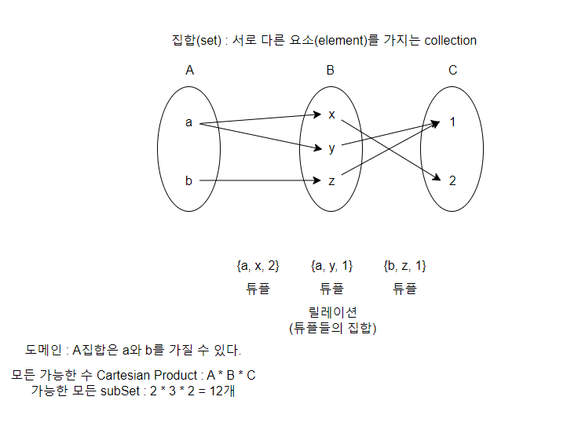

# 데이터베이스

- 전자적으로 저장되고 사용되는 구조적(structed)으로 연관(relate)된 **데이터가 조직화된 집합**

1. 데이터 : 관찰의 결과로 나타난 실제 값
2. 정보 : 데이터에 의미를 부여한 것
3. 지식 : 사물이나 현상에 대한 이해

## 데이터 베이스의 개념
1. 통합된 데이터 : 여러 곳에서 사용하던 데이터를 통합하여 하나로 저장
2. 저장된 데이터 : 문서로 보관되지 않고 컴퓨터 등의 전자 장치에 저장
3. 운영 데이터 : 업무에 필요한 목적으로 저장된 데이터
4. 공용 데이터 : 여러 사람과 여러 업무에 공동으로 사용되는 데이터

## 특징
1. 실시간 접근
2. 계속 변화
3. 동시 공유
4. 데이터의 값(내용)으로 참조

## 데이터 베이스 시스템 구성 요소
1. DBMS(DataBase Management System) : DB를 관리하는 소프트웨어
    - MySQL, Oracle, PostgreSQL, MariaDb, MSSQL, ...
2. DB 서버 : DBMS가 실행되는 시스템
3. DB : 하드 디스크에 물리적으로 저장되는 데이터를 모아둔 토대
4. 데이터 모델 : 데이터가 저장되는 방법

## 데이터 모델
- 현실 세계의 정보를 어떻게 구조화하고 조직화할지에 대한 청사진
    - 예) 도서관 DB : 첵(제목, 저자, 출판년도, 출판사)

    1. 개념적 데이터 모델
        - 일반 사용자들도 쉽게 이해할 수 있는 개념 모델
    2. 논리적 데이터 모델
        - 이해하기 어렵지 않으면서도 상세하게 DB를 구조화할 수 있는 모델
        - 특정 DBMS에 종속되지 않음.
    3. 물리적 데이터 모델
        - 특정 DBMS에 저장이 될 수 있게 디테일하게 설계

### ER모델

### 데이터 모델의 종류
- 계층형 데이터 모델 (Hierachial 부모-자식 관계 트리구조)
- 네트워크형 데이터 모델 (Network 다대다 관계)
- **관계형 데이터 모델** (Relational 데이터를 테이블로 조직화)
- 객체지향 데이터 모델 (Object-Oriented 데이터를 객체로 표현)
- NoSQL(Not Only SQL) : 비관계형, 문서, Key-value 등

## 스키마와 상태
- 스키마(Schema) : DB의 구조나 설계
    - 구체적인 데이터 항목이나 값은 포함하지 않음
    - DB 설계 초기에 정의되고, 상대적으로 변경이 적음
    - 정적인 특성, 근본적인 요소
- 상태(Status) : 특정 시점에 DB에 실제로 저장된 데이터 집합
    - 시간에 따라 변할 수 있고 지속적으로 업데이트
    - DB의 일관성과 무결성 유지를 위해 스키마의 규칙과 제약 조건을 따라야 함
    - 동적인 특성, 변화하는 데이터의 실체

## 3 Schema Architecture
1. 내부 스키마 : 물리적 저장 장치에 DB가 실제로 저장되는 방법
2. 개념 스키마 : DB의 논리적 구조, 데이터, 관계, 제약 사항, 무결성 등이 포함. 하나의 DB는 개념 스키마가 존재한다.
3. 외부 스키마 : 일반 사용자나 외부에서 보는 DB의 일부분, View, 하나의 DB에 여러 개의 외부 스키마가 있을 수 있음.

## 관계형 데이터 모델

- 개념 정의
    - 속성(attribute) : 릴레이션이 가지는 집합
    - 도메인(domain) : 속성이 가질 수 있는 개별 값의 집합
    - 튜플(tuple) : 각 속성의 값들로 이루어진 목록(행)
    - 릴레이션(relation) : 튜플들의 집합
    - 차수(degree) : 속성의 개수
    - 카디널리티(cardinality) : 튜플의 수

- 테이블로 정의되었을 때 용어
    - 릴레이션 -> 테이블
    - 튜플 -> 행(row)
    - 속성 -> 열(column)
    - 도메인 -> 데이터 타입

## 무결성 제약조건
- 무결성(integrity) : 데이터의 정확성과 일관성
- 제약 조건(Constraint) : 무결성을 보장하기 위해 DB 상태를 유지하는 것

1. 개체(Entity) 무결성 제약 조건
    - 각 릴레이션의 기본 키는 NULL이거나 중복된 값을 가질 수 없다.
2. 참조(Referential) 무결성 제약 조건
    - 외래 키 값은 NULL일 수 없고, 참조하는 릴레이션의 기본 키 값과 같아야 한다.
3. 도메인(Domain) 무결성 제약 조건
    - 각 속성은 지정된 도메인에 속한 값이어야 한다.